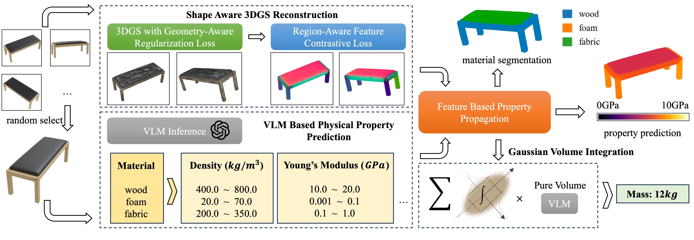

# PUGS
The repository provides code for the paper "PUGS: Zero-shot Physical Understanding with Gaussian Splatting".

- 🎉 Our paper have been accepted by [ICRA 2025](https://2025.ieee-icra.org/) 🎉

# Prerequisites
## Installation

We recommend using conda to install the dependencies.

```bash
conda env create -f environment.yml

conda activate pugs
```

## Data Preparation

Follow the [NeRF2Physics](https://github.com/ajzhai/NeRF2Physics), we also use the ABO-500 dataset for testing. You can download the dataset [here](https://github.com/ajzhai/NeRF2Physics?tab=readme-ov-file#abo-500-dataset). The data should be organized as follows:

```shell
data
├── abo_500
    ├── scenes
    │   ├── scene0000
    │   │   ├── images
    │   │   │   ├── image0000.jpg
    │   │   │   └── ...
    │   │   └── transforms.json
    │   └── ...
    ├── filtered_product_weights.json
    └── splits.json
```

If you want to use your own data, you should organize the data in the same way or other formats which can be parsed by the `scene/dataset_readers.py`.

## Pretrained Model

In our reconstruction pipeline, we use SAM to get regions of the object. In default, we use the public ViT-H model for SAM. You can download the model from [here](https://dl.fbaipublicfiles.com/segment_anything/sam_vit_h_4b8939.pth) and put it under the `./submodules/segment-anything/sam_ckpt/` directory.

## OpenAI API Key

Our method uses VLM to predict the physical properties of the object. During the inference, we use OpenAI API to get the physical properties. You need to get an OpenAI API key and put it in the `my_api_key.py` file. You can get the key from [OpenAI](https://platform.openai.com/api-keys), and set a variable named `OPENAI_API_KEY` in the `my_api_key.py` file.

```bash
echo "OPENAI_API_KEY = '<yourkey>'" >> ./my_api_key.py
```

# Pipeline

Our pipeline is shown below, each step is a separate python script. Related arguments can be found in the `settings.py`.



## Shape Aware 3DGS Reconstruction

Firstly, we use 3DGS to reconstruct the object from multi-view images. During the training, we use Geometry-Aware Regularization Loss and Region-Aware Feature Contrastive Loss to improve the quality of the reconstruction.

```bash
python gs_reconstruction.py
```

## VLM Based Physical Property Prediction

We use VLM to predict the physical properties of the object. You can specify the property name using `--property_name`. And you can specify the type of the inference using `--proposal_type`. If you want to use VLM to predict the physical properties of the object, you can specify the type of the inference as `gpt4o` or `gpt4v`.

```bash
python material_proposal.py --property_name <property-name> --mats_save_name info --proposal_type <gpt4o|gpt4v>
```

We also provide a text-reasoning based inference. You can specify the type of the inference as `text-reasoning` to use this mode. The text-reasoning based inference means two-stage inference. First, we use VLM to generate the caption of the object. Then, we use LLM to predict the physical properties. Therefore, you need to specify the name of the saved caption using `--caption_load_name`.

```bash
python material_proposal.py --property_name <property-name> --caption_load_name info --mats_save_name info --proposal_type text-reasoning 
```

## Feature Based Property Propagation

This step gets the clip feature for source points, which will be used for property propagation.

```bash
python clip_feature_fusion.py
```
Then we can predict the physical properties of the object. The following command specify the prediction mode as `grid`, which can get dense prediction result of the physical properties about specific property.

```bash
python predict_property.py --mats_load_name info --property_name <property-name> --prediction_mode grid
```

If you want to predict the object-level physical properties, you can specify the type of the inference as `integral`, and specify the method for volume estimation in `volume_method`.

```bash
python predict_property.py --mats_load_name info --property_name <property-name> --prediction_mode integral --volume_method gaussian --preds_save_name mass 
```

# Other Utilities

We also provide some other utilities for evaluation and visualization.

## Evaluation

This script evaluates the predictions. You can specify the path to the predictions and ground truth using `--preds_json_path` and `--gts_json_path`.

```bash
python evaluation.py --preds_json_path <path-to-predictions> --gts_json_path <path-to-ground-truth>
```

## Visualization

For the reconstruction results, you can use the following command to visualize the results.

```bash
python visualization.py --scene_name <scene-name> --property_name <property-name> --value_low <value-low> --value_high <value-high>
```

## Video Rendering

You can use the following command for video rendering, you can render the 360 degree video about the reconstructed object.

```bash
python video_render.py -m <path-to-model> --render_path --export_traj
```

# Acknowledgements

Some parts of the code are borrowed from [NeRF2Physics](https://github.com/ajzhai/NeRF2Physics), [SegAnyGaussians](https://github.com/Jumpat/SegAnyGaussians), [PGSR](https://github.com/zju3dv/PGSR) and [2DGS](https://github.com/hbb1/2d-gaussian-splatting). We thank the authors for their great work.


